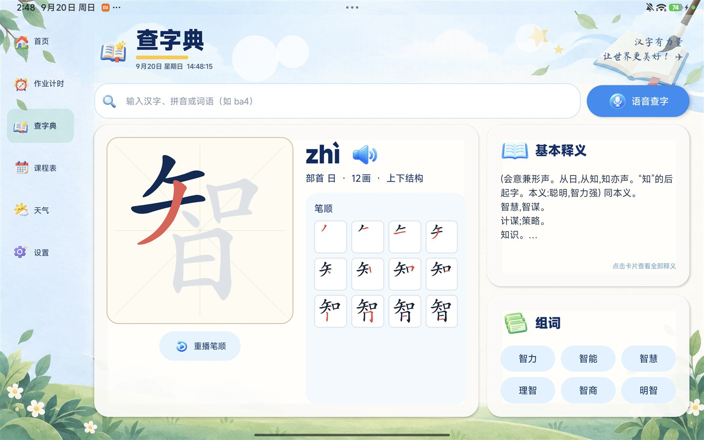
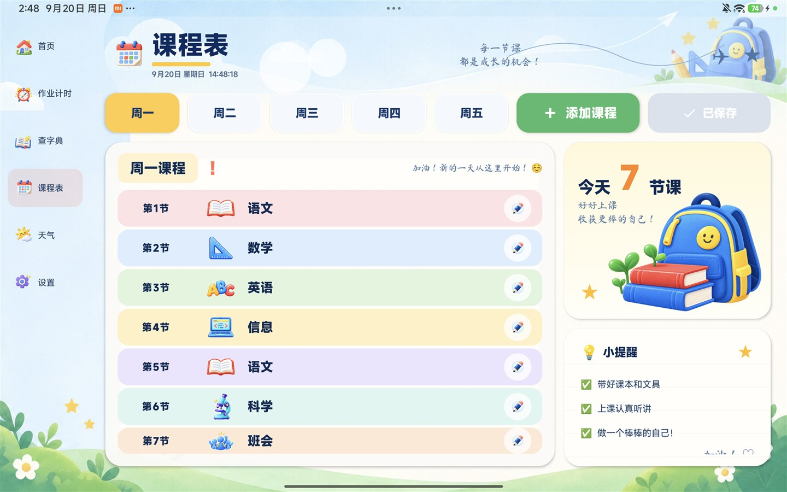
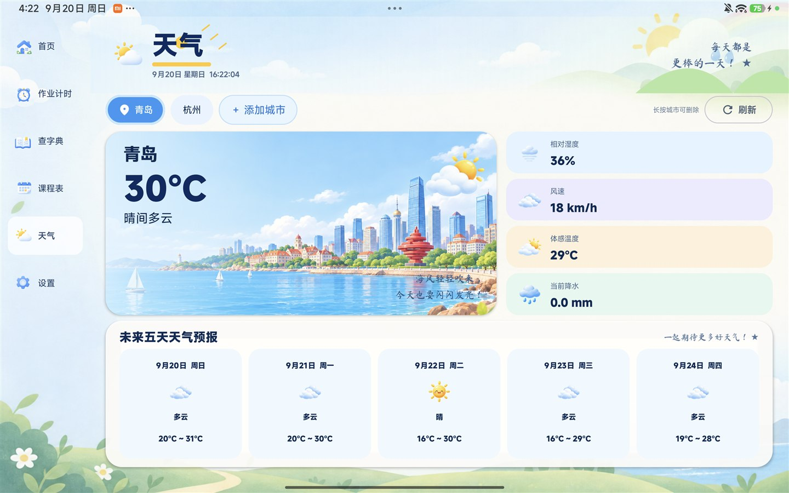
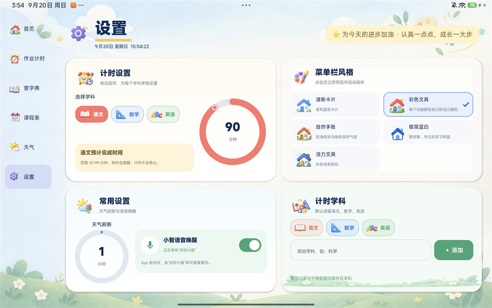

# Mira 学习助手

面向小学生的横屏学习工具，使用 Kotlin 与 Jetpack Compose 原生开发。目前功能与界面以小米 Pad 6 Pro 为主要设计和实机验证目标，包含作业计时、离线字典、课程表、天气、每日好句及学习进度等功能。


## 界面预览

| 作业计时 | 查字典 |
| --- | --- |
|  |  |

| 课程表 | 天气 |
| --- | --- |
|  |  |

| 设置 |
| --- |
|  |

## 当前功能

- **首页概览**：快速开始作业计时、查字典、查看当日课程、每日好句、本周学习进度和当前位置天气。
- **作业计时**：按学科设置 10～99 分钟的预计时间，支持开始、暂停、重置和完成；按天或按学科查看本周作业时长。
- **离线字典**：内置约 3500 个常用汉字，可按汉字、词语、无声调拼音或数字声调拼音（如 `zhi4`）查询；支持系统普通话朗读、组词和逐笔笔顺演示。
- **语音查字**：可以说“智能的智怎么写”等自然语句；开启小智语音唤醒后，可在应用前台说“你好小智”再提出问题。
- **课程表**：按周一至周五管理课程，可连续编辑多天并统一保存，内置常见学科图标。
- **天气**：支持当前位置、手动添加城市、长按删除城市、刷新间隔设置、当前天气数据和未来五天预报。
- **个性化设置**：提供五套菜单栏图标风格、每科预计时间、天气刷新间隔及计时学科管理。
- **本地存储**：课程、计时设置、完成记录、城市列表和界面偏好均保存在本机。

## 使用方法

### 作业计时

1. 在首页或“作业计时”页面选择学科。
2. 如需修改该学科预计时间，点击“设置科目预计时间”，或进入“设置 → 计时设置”拖动圆环。
3. 点击“开始计时”；暂停、重置和完成使用不同颜色按钮区分。
4. 到达预计时间时应用会发送提醒，但计时不会自动停止；完成后记录会计入本周统计。

### 查字典

1. 输入单个汉字、词语或拼音，例如“智”“智能”“zhi”或“zhi4”。
2. 点击候选汉字切换结果；点击扬声器朗读读音。
3. 笔顺区域可查看逐笔动画，释义卡片可展开查看完整内容。
4. 点击“语音查字”后，说出要查询的字或自然问题。

### 课程表

1. 选择星期后点击某节课程右侧的编辑按钮，或点击“添加课程”。
2. 可以依次修改多个日期；未保存的编辑会暂存在当前页面。
3. 完成全部修改后点击顶部“保存”，一次写入所有变更。

### 天气

1. 首次使用时允许定位权限，即可获取当前位置天气。
2. 点击“添加城市”可通过城市名称添加常用地点。
3. 长按手动添加的城市标签可删除；当前位置城市不能删除。
4. 可在“设置 → 常用设置”中将自动刷新间隔设为 1～12 小时。

### 小智语音唤醒

1. 在“设置 → 常用设置”中打开“小智语音唤醒”，并允许麦克风权限。
2. 应用处于前台时说“你好小智”，随后说出查字问题。
3. 唤醒词检测使用本地模型；唤醒后的整句识别由设备上的 Android 语音识别服务完成。

## 权限与联网说明

| 权限或能力 | 用途 |
| --- | --- |
| 网络 | 获取 Open-Meteo 天气数据；部分设备的系统语音识别也可能需要联网 |
| 麦克风 | 语音查字和“你好小智”唤醒 |
| 粗略/精确位置 | 获取当前位置和当地天气 |
| 通知 | 在预计作业时间到达时提醒 |
| 精确闹钟 | 提高计时提醒的准时性 |

离线字典、课程表、计时记录和唤醒词检测不需要访问服务器。语音整句识别的联网行为取决于设备安装的语音识别服务。

## 兼容性

- 最低系统版本：**Android 9（API 28）**。
- 当前 APK 仅包含 **`arm64-v8a`**，适用于多数近年的 Android 手机和平板；不支持 32 位 ARM 设备和 x86/x86_64 模拟器。
- 当前界面针对 **小米 Pad 6 Pro、2880×1800、横屏**完成实机调试。
- 应用固定为横屏，并在宽度小于 `720dp` 时将左侧菜单切换为底部导航。
- 其他 ARM64 横屏平板通常可以运行，但 4:3、3:2、超宽屏、小尺寸平板及较大系统字体尚未逐台验证，背景裁切和卡片间距可能存在差异。
- 手机内部页面尚未完成专门的紧凑布局；虽然部分横屏手机可以运行，但可能出现控件拥挤或需要滚动的情况。
- **目前不支持手机竖屏体验**。如需正式覆盖手机，建议为首页、计时、字典、课程表和设置分别增加单列布局。

## 当前限制

- 天气必须联网，天气服务、系统定位或城市地理编码暂时不可用时无法刷新。
- 语音查字依赖系统提供的 Android 语音识别服务；未安装该服务或被系统限制时只能使用键盘查询。
- “你好小智”只在应用前台启用，不是系统级常驻语音助手。
- 字典数据来自开源数据集，个别字的释义、组词、笔顺或读音仍可能需要人工校核。
- 当前没有账号、云同步、多设备同步或应用内数据导出功能；恢复能力取决于 Android 系统备份。
- 每日好句来自内置内容，不会从网络自动更新。
- 目前提供的是调试构建，尚未配置正式发布签名、应用商店渠道和自动升级。

## 构建

使用 Android Studio 打开项目并等待 Gradle 同步，或在已配置 JDK/Android SDK 的 Windows 环境运行：

```powershell
.\gradlew.bat testDebugUnitTest assembleDebug
```

调试 APK 生成于：

```text
app/build/outputs/apk/debug/app-debug.apk
```

## 离线数据与许可

- 字形、拼音、释义：`mapull/chinese-dictionary`（MIT，原始项目也提示数据仍需人工校核）。
- 现代组词排序：`jelleverheyen/hsk-vocabulary`（MIT）。
- 笔顺矢量路径：`Make Me a Hanzi`（Arphic Public License）。
- 许可原文随 APK 放在 `app/src/main/assets/licenses/`；数据库可通过 `tools/build_dictionary.py` 重建。
